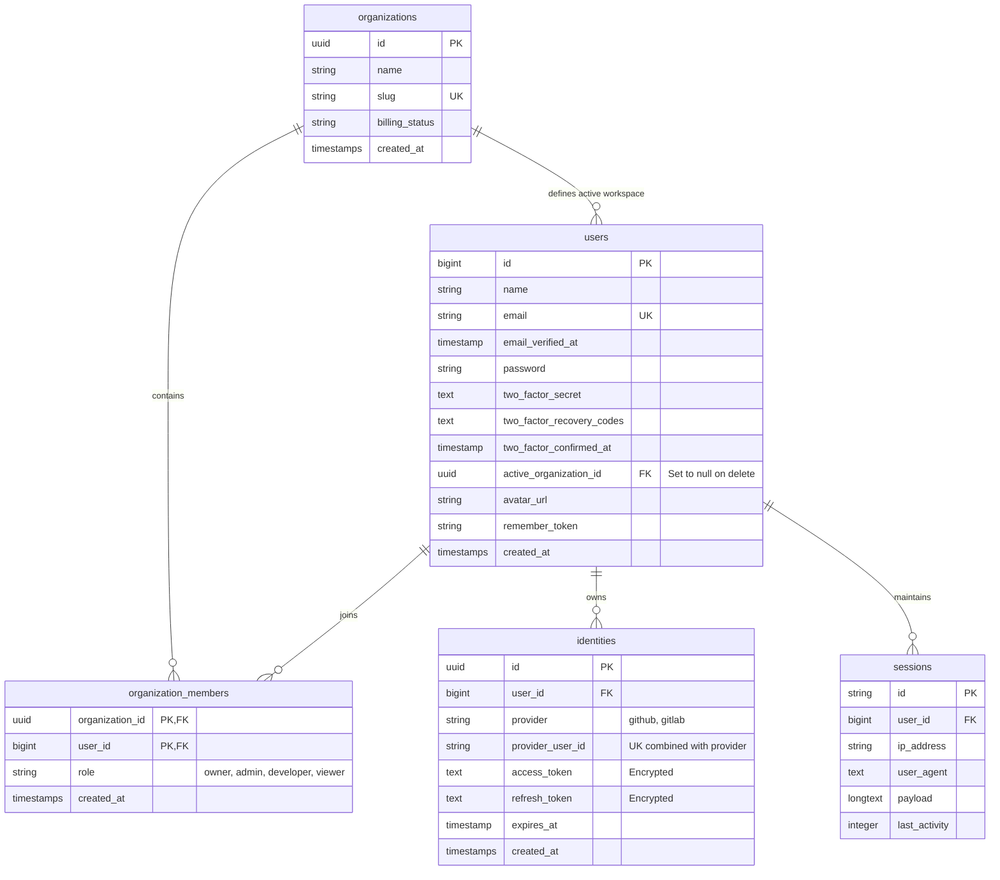

# DevOS Database Design & Multi-Tenancy Architecture

This document outlines the database schema, multi-tenant isolation strategy, and authentication features implemented for the **DevOS (AI Developer Operating System)**.

---

## 1. Multi-Tenant Relationship Schema (ERD Model)

We use a polyglot persistence database structure, with **MySQL** serving as the core transactional engine for Identity, Workspaces, Members, and Active Sessions.



---

## 2. Multi-Tenant Isolation Security

To prevent data bleeding (cross-tenant contamination), we partition all core records using an `organization_id` or `workspace_id` column.
In Laravel, we enforce this globally using **Global Query Scopes**.

### Laravel Implementation Example:
```php
namespace App\Models\Scopes;

use Illuminate\Database\Eloquent\Builder;
use Illuminate\Database\Eloquent\Model;
use Illuminate\Database\Eloquent\Scope;
use Illuminate\Support\Facades\Auth;

class TenantScope implements Scope
{
    public function apply(Builder $builder, Model $model): void
    {
        if (Auth::check() && Auth::user()->active_organization_id) {
            $builder->where('organization_id', Auth::user()->active_organization_id);
        }
    }
}
```
This is registered in the boot method of tenant-related models, automatically appending `WHERE organization_id = active_organization_id` to all queries (Select, Update, Delete).

---

## 3. Two-Factor Authentication (2FA)

Fortify provides native support for **TOTP (Time-based One-Time Password)**. 
* Enabled users store an encrypted secret in `two_factor_secret`.
* Authenticator app scans a QR Code displaying `otpauth://totp/...` protocol.
* Verification triggers signature checks on `two_factor_confirmed_at` to mark it active.
* Users are supplied with 8 secure `two_factor_recovery_codes` to log in if they lose their device.

---

## 4. Stateful Session & Device Limiting

To enforce the **maximum of 2 active devices** policy:
1. Every successful login records a stateful row inside the `sessions` table.
2. In our authentication middleware, we check the active session counts before issuing a token or setting cookie payloads.

### Check Algorithm:
```php
$activeSessionsCount = DB::table('sessions')
    ->where('user_id', $user->id)
    ->count();

if ($activeSessionsCount >= 2) {
    // Return custom warning response with status 423 (Locked / Limit Exceeded)
    // Client side shows UI offering to:
    // 1. Terminate the oldest session: DB::table('sessions')->where('user_id', $user->id)->orderBy('last_activity', 'asc')->first()->delete();
    // 2. Terminate all other sessions: DB::table('sessions')->where('user_id', $user->id)->where('id', '!=', current_session_id)->delete();
}
```
This guarantees that no user account can bypass the security threshold.
